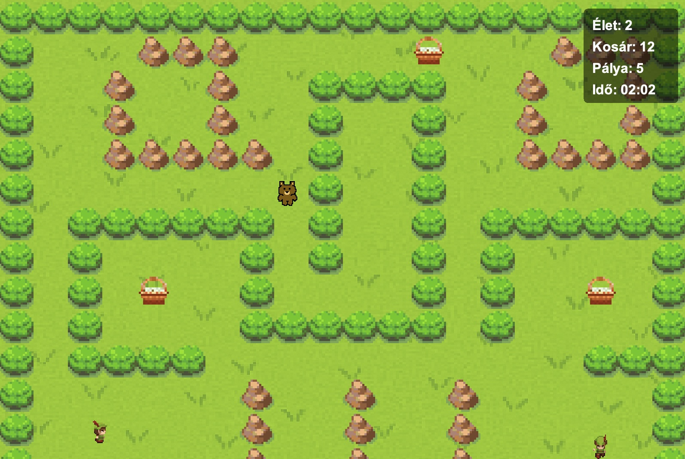

# Maci Laci (Yogi Bear)

A 2D grid-based desktop game developed in Java. The player controls Yogi Bear navigating through Yellowstone National Park, collecting picnic baskets while avoiding patrolling rangers.

## Tech Stack
- Language: Java 25
- GUI Framework: Java Swing / AWT
- Build Tool: Maven
- Database: Apache Derby

## Controls
- *W, A, S, D*: Move Yogi Bear
- *ESC*: Pause / Resume game

## Key Features
- *Custom Game Engine*: Built from scratch using `javax.swing.Timer` for a consistent 60 fps game loop.
- *Persistent Leaderboard*: Embedded Apache Derby database that automatically initializes and stores high scores.
- *Smart Resource Management*: Implementation of `ImageCache` and `SoundManager` to prevent memory leaks and redundant I/O operations.